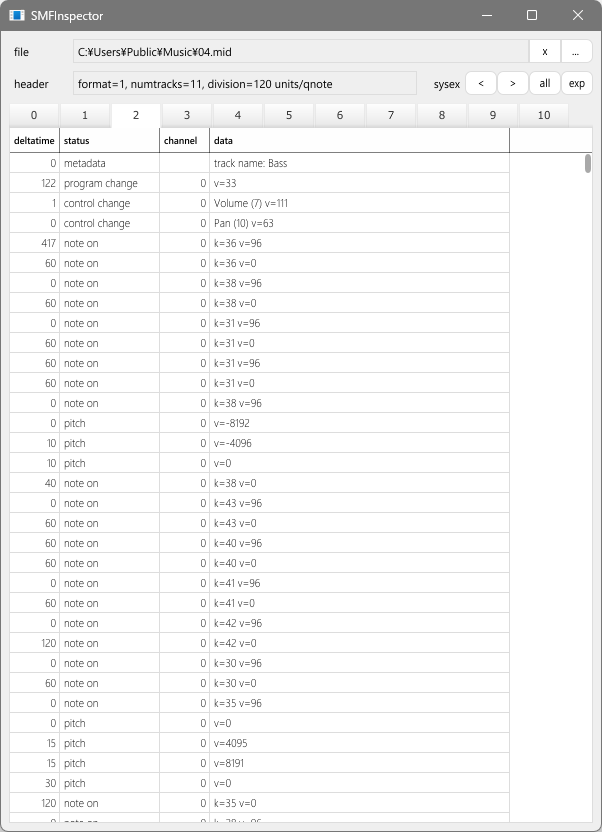

# SMFInspector
 

## What is this?

A handy tool to inspect standard MIDI files (SMF) or RIFF MIDI files.  
This tool breaks down SMF into the header, tracks and events.  
Quick & dirty implementation with JUCE.

## Requirement

* JUCE framework: [download](https://juce.com/get-juce/download), [repository](https://github.com/juce-framework/JUCE)
* Projucer: [download](https://juce.com/discover/projucer), or build from source
* C++ build tools: Visual Studio, Xcode, etc.

The JUCE version was 4.3.0 when I started writing the code, and later migrated to 7.0.1.

## How to build

1. Open the .jucer file with the Projucer.
2. Correct the JUCE module path and properties, add exporters and save.
3. Build the generated C++ projects.

## Written by

[yu2924](https://twitter.com/yu2924)

## License

CC0 1.0 Universal
